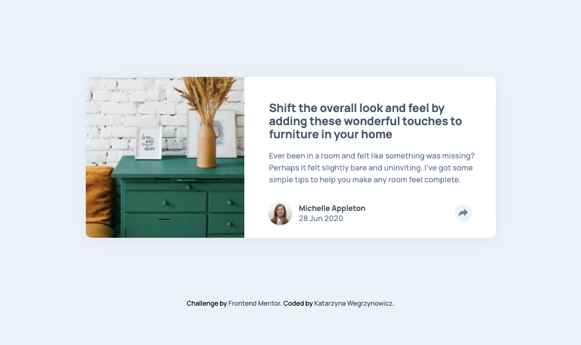

<!-- readme file t-->

# Frontend Mentor - Article preview component solution

This is a solution to the [Article preview component challenge on Frontend Mentor](https://www.frontendmentor.io/challenges/article-preview-component-dYBN_pYFT). Frontend Mentor challenges help you improve your coding skills by building realistic projects. 

## Table of contents

- [Overview](#overview)
  - [The challenge](#the-challenge)
  - [Screenshot](#screenshot)
  - [Links](#links)
  - [Built with](#built-with)
  - [Useful resources](#useful-resources)
- [Author](#author)

## Overview

### The challenge

Users should be able to:

- View the optimal layout for the component depending on their device's screen size
- See the social media share links when they click the share icon

### Screenshot

### Links

- Solution URL: [https://github.com/katarzyna-kw/article-preview](https://github.com/katarzyna-kw/article-preview)
- Live Site URL: [https://katarzyna-kw.github.io/article-preview](https://katarzyna-kw.github.io/article-preview)

### Built with

- Semantic HTML5 markup
- CSS custom properties
- Flexbox
- Mobile-first workflow

### Useful resources

- [CSS-Tricks.com](https://css-tricks.com/almanac/properties/p/position/) - This was a helpful resource for using positioning to code the design prototypes.
- [Animating CSS Popup](https://www.loginradius.com/blog/async/animating-simple-css-popup-tutorial/) - This was a helpful tutorial for animating popups.

## Author

- Website - [Katarzyna Wegrzynowicz](https://katarzyna-kw.github.io/portfolio-website/)
- Frontend Mentor - [@katarzyna-kw](https://www.frontendmentor.io/profile/katarzyna-kw)
- Github - [@katarzyna-kw](https://github.com/katarzyna-kw)